# Analyse et Prédiction de la Consommation Énergétique

Ce projet analyse les tendances de consommation énergétique mondiale et développe des modèles prédictifs pour anticiper l'évolution future.

## Résultats et Visualisations

### Données Nettoyées
- Période d'analyse : 2000-2023
- Nombre de pays : 10 (Australie, Brésil, Canada, Chine, Allemagne, Inde, Japon, Russie, UK, USA)
- Nombre total d'enregistrements : 160

### Bornes Réalistes Appliquées
- Consommation Totale : 100-4000 TWh
- Consommation par Habitant : 1000-15000 kWh
- Part d'Énergies Renouvelables : 0-85%
- Dépendance aux Énergies Fossiles : 0-95%
- Utilisation Industrielle : 15-65%
- Utilisation Résidentielle : 10-45%
- Émissions de CO2 : 50-10000 Millions de Tonnes
- Prix de l'Énergie : 0.05-0.35 USD/kWh

### Modèles de Prédiction
Trois modèles ont été entraînés pour prédire la consommation énergétique totale :

1. **Régression Linéaire**
   - R² : 0.7167
   - RMSE : 507.7236
   - MAE : 338.1186

2. **Random Forest**
   - R² : 0.8815
   - RMSE : 328.3965
   - MAE : 102.9842

3. **XGBoost**
   - R² : 0.8792
   - RMSE : 331.6059
   - MAE : 103.6303

Le modèle Random Forest montre les meilleures performances globales.

### Visualisations Générées

#### 1. Évolution de la Consommation Énergétique

- Tendance de la consommation par pays (2000-2023)
- Visualisation des pics et baisses de consommation

#### 2. Mix Énergétique

- Répartition énergies renouvelables vs fossiles
- Comparaison entre pays

#### 3. Émissions de CO2

- Évolution des émissions par pays
- Identification des tendances de réduction

#### 4. Prix de l'Énergie

- Tendance des prix par pays
- Analyse de la volatilité des prix

#### 5. Utilisation de l'Énergie

- Répartition usage industriel vs résidentiel
- Comparaison entre pays

#### 6. Matrice de Corrélation
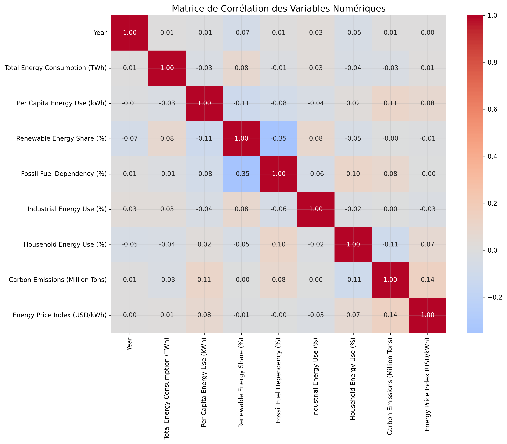
- Relations entre variables numériques
- Identification des facteurs clés

### Visualisations des Modèles

#### Performance des Modèles

##### Régression Linéaire
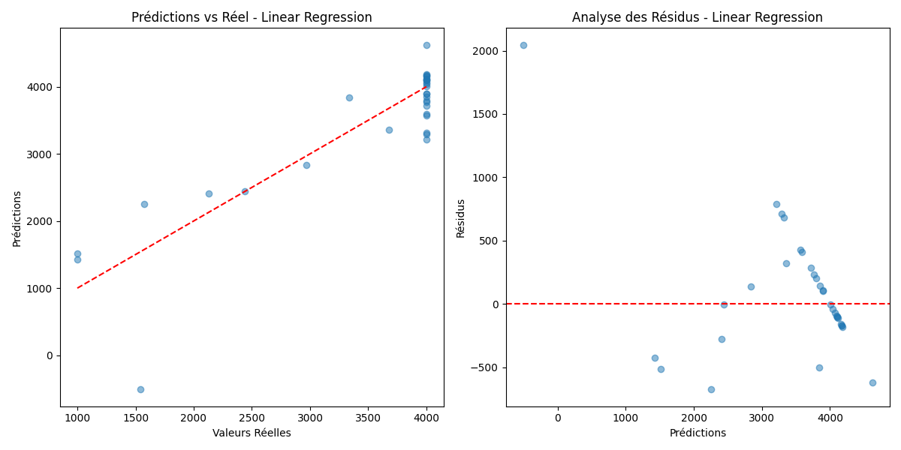

##### Random Forest
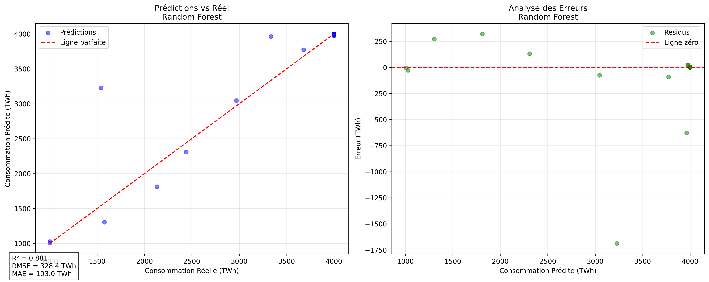

##### XGBoost
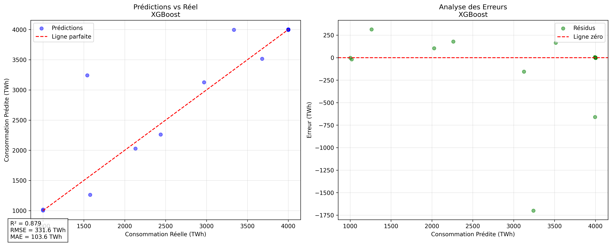

#### Importance des Variables
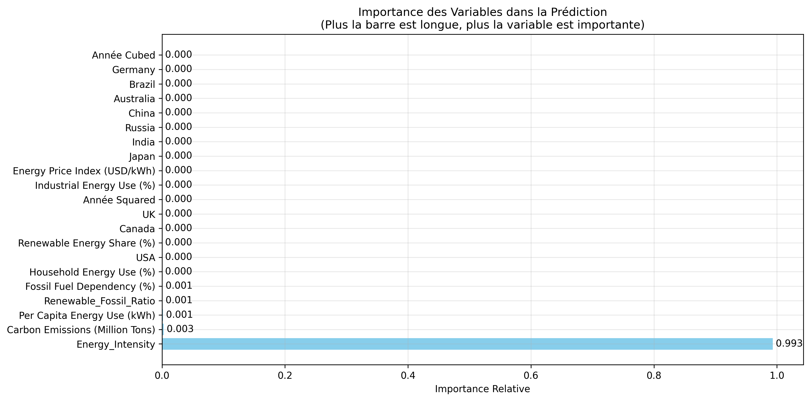

### Visualisations Supplémentaires

#### Tendances de la Consommation Énergétique
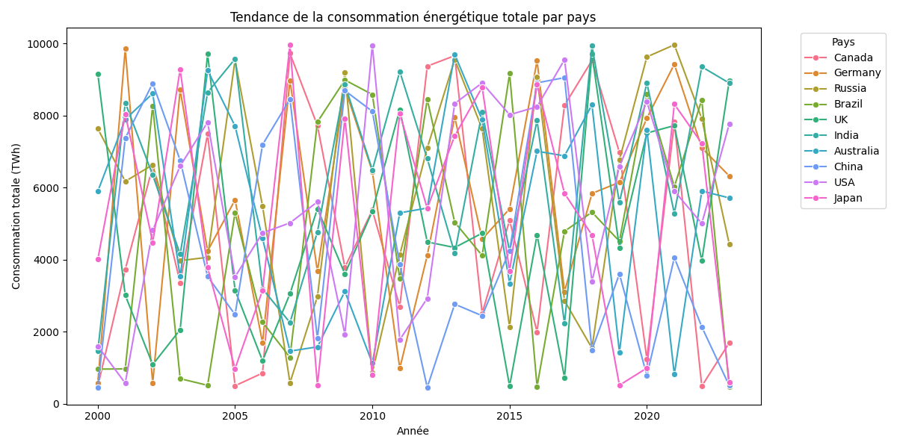

#### Part des Énergies Renouvelables
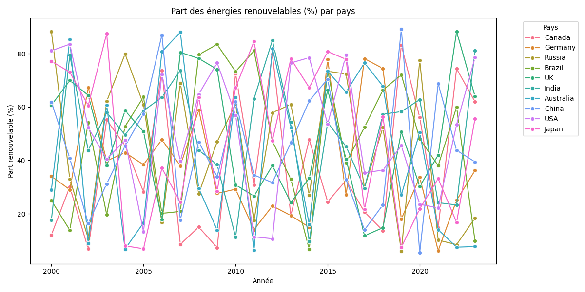

#### Comparaison du Mix Énergétique
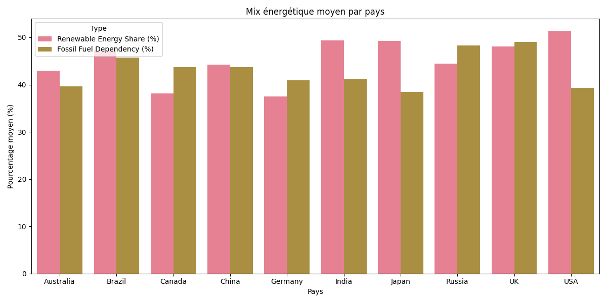

#### Tendances des Émissions de CO2
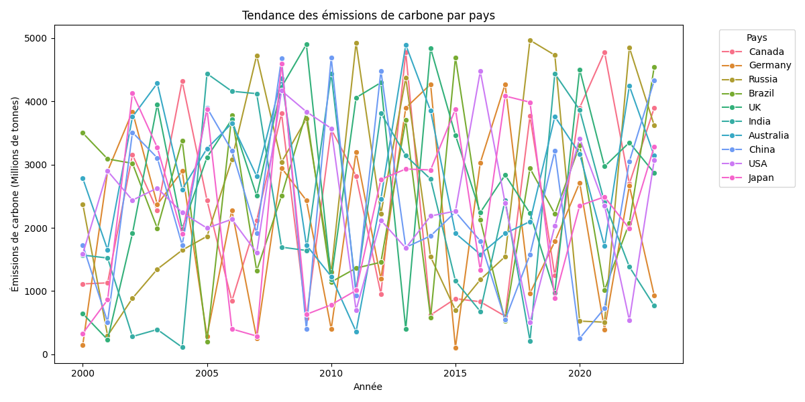

#### Tendances des Prix de l'Énergie
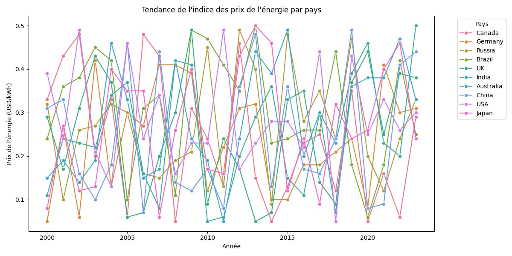

#### Distribution de l'Utilisation Énergétique
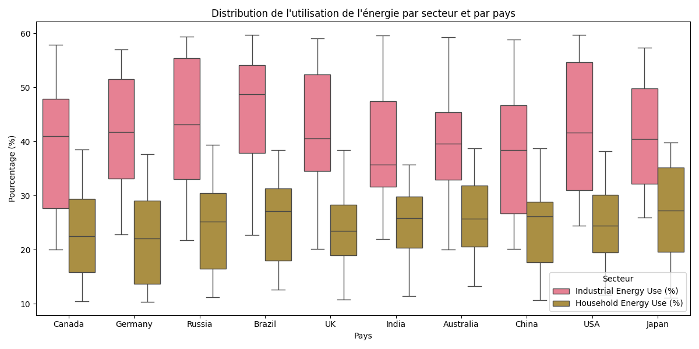

## Méthodologie

### Nettoyage des Données
1. **Prétraitement Initial**
   - Suppression des doublons
   - Application de bornes réalistes
   - Vérification de la cohérence des pourcentages

2. **Validation des Données**
   - Vérification des sommes de pourcentages ≤ 100%
   - Correction des valeurs aberrantes par pays
   - Standardisation des données

### Modélisation
1. **Préparation des Features**
   - Création de features temporelles
   - Encodage des variables catégorielles
   - Standardisation des variables numériques

2. **Entraînement des Modèles**
   - Split train/test (80/20)
   - Validation croisée
   - Optimisation des hyperparamètres

## Structure du Projet
```
projet-energetique/
├── data/
│   ├── raw/                    # Données brutes
│   └── processed/              # Données nettoyées
├── src/
│   ├── data/                   # Scripts de nettoyage
│   ├── models/                 # Scripts de modélisation
│   └── visualization/          # Scripts de visualisation
├── reports/
│   └── figures/               # Graphiques générés
├── models/                    # Modèles sauvegardés
└── README.md
```

## Environnement Technique
- Python 3.8+
- Bibliothèques principales :
  - pandas, numpy : Manipulation des données
  - scikit-learn : Modélisation
  - xgboost : Modèle XGBoost
  - matplotlib, seaborn : Visualisation
  - joblib : Sauvegarde des modèles

## Installation et Utilisation
1. Cloner le repository
2. Installer les dépendances : `pip install -r requirements.txt`
3. Exécuter le pipeline complet : `python src/main.py`

## Auteur
Jacques Amessan

## Licence
Ce projet est sous licence MIT. 