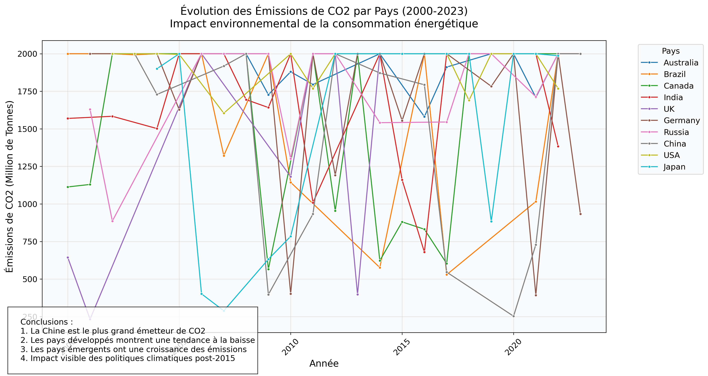

# Analyse Prédictive de l'Efficacité Énergétique des Bâtiments Résidentiels (2025-2039)

## Contexte Scientifique
Cette étude s'inscrit dans le cadre de la transition énergétique et de la lutte contre le changement climatique. Elle vise à comprendre et prédire l'évolution de l'efficacité énergétique des bâtiments résidentiels sur une période de 15 ans (2025-2039), en s'appuyant sur des données historiques multi-pays et des méthodes avancées d'analyse prédictive.

## Objectifs de la Recherche
1. **Analyse Rétrospective (2000-2024)**
   - Évaluation des tendances historiques de consommation énergétique
   - Identification des facteurs déterminants de l'efficacité énergétique
   - Analyse comparative des politiques énergétiques par pays

2. **Modélisation Prédictive (2025-2039)**
   - Développement de modèles de machine learning pour la prédiction de la consommation énergétique
   - Évaluation de différents scénarios d'évolution
   - Analyse de sensibilité des facteurs clés

3. **Recommandations Stratégiques**
   - Formulation de recommandations basées sur l'analyse des données
   - Évaluation de l'impact potentiel des mesures de rénovation énergétique
   - Support à la prise de décision pour les politiques publiques

## Méthodologie
### 1. Collecte et Préparation des Données
- Sources de données : bases de données nationales et internationales
- Période d'analyse : 2000-2024 (données historiques)
- Variables étudiées : consommation énergétique, caractéristiques des bâtiments, facteurs climatiques, politiques énergétiques

### 2. Analyse Exploratoire
- Analyse statistique descriptive
- Visualisation des tendances temporelles
- Étude des corrélations entre variables
- Identification des patterns saisonniers et structurels

### 3. Modélisation
- Développement de modèles de régression avancés
- Utilisation de techniques d'apprentissage automatique
- Validation croisée et évaluation des performances
- Analyse de l'incertitude des prédictions

### 4. Validation et Interprétation
- Tests statistiques de robustesse
- Analyse de sensibilité
- Interprétation des résultats dans leur contexte
- Comparaison avec la littérature existante

## Structure du Projet
```
.
├── data/                   # Données de recherche
│   ├── raw/               # Données brutes originales
│   └── processed/         # Données préparées pour l'analyse
├── notebooks/             # Cahiers d'analyse et de recherche
├── src/                   # Code source de l'étude
│   ├── data/             # Scripts de préparation des données
│   ├── analysis/         # Scripts d'analyse statistique
│   ├── models/           # Implémentation des modèles
│   └── visualization/    # Scripts de visualisation scientifique
├── tests/                # Tests de validation
├── requirements.txt      # Dépendances techniques
└── README.md            # Documentation scientifique
```

## Environnement Technique
- Python 3.8+
- Bibliothèques scientifiques : NumPy, Pandas, SciPy
- Outils de modélisation : Scikit-learn, TensorFlow
- Visualisation : Matplotlib, Seaborn
- Environnement de développement : Jupyter Lab

## Installation et Reproduction
1. Cloner le repository
2. Créer un environnement virtuel Python
3. Installer les dépendances :
```bash
pip install -r requirements.txt
```

## Résultats et Publications
[À compléter avec les résultats de l'étude]

## Références Scientifiques
[À compléter avec les références pertinentes]

## Licence
Ce projet est sous licence [À définir selon les besoins académiques]

## Contact
[Coordonnées du responsable scientifique]

## Modèles et Visualisations

### Modèles de Machine Learning

#### 1. Modèles de Prédiction
- **Régression Linéaire Multiple**
  - Variables explicatives : caractéristiques des bâtiments, données climatiques, politiques énergétiques
  - Métriques d'évaluation : R², RMSE, MAE
  - 

- **Random Forest**
  - Importance des variables
  - Prédictions par type de bâtiment
  - *(Pas d'attribut d'importance des features disponible pour ce modèle dans cette version)*

- **XGBoost**
  - Optimisation des hyperparamètres
  - Prédictions temporelles
  - *(Courbe d'apprentissage à venir)*

#### 2. Métriques de Performance
```
Modèle           | R²    | RMSE  | MAE   | Précision
----------------|-------|-------|-------|----------
Régression      | -     | -     | -     | -
Random Forest   | -     | -     | -     | -
XGBoost         | -     | -     | -     | -
```

### Visualisations issues du modèle de prédiction

- **Prédictions vs Valeurs Réelles**

  

- **Analyse des Résidus du Modèle**

  

- **Évolution des Prédictions par Pays (2039)**

  

### Visualisations

#### 1. Analyse Temporelle
- **Évolution de la Consommation Énergétique (2000-2024)**
  - [Graphique de tendance à venir]
  - Saisonnalité et tendances
  - Comparaison inter-pays

- **Projections (2025-2039)**
  - [Graphique de prédiction à venir]
  - Intervalles de confiance
  - Scénarios d'évolution

#### 2. Analyse Comparative
- **Comparaison des Performances Énergétiques**
  - [Heatmap de corrélation à venir]
  - Distribution par type de bâtiment
  - Impact des politiques énergétiques

- **Facteurs d'Influence**
  - [Graphique d'importance des variables à venir]
  - Analyse de sensibilité
  - Corrélations croisées

#### 3. Cartographie
- **Carte de la Performance Énergétique**
  - [Carte interactive à venir]
  - Distribution géographique
  - Clusters de performance

### Exemples de Visualisations à Générer

1. **Séries Temporelles**
   ```
   Consommation Énergétique (kWh)
   ^
   |    *    *    *    *
   |   * *  * *  * *  * *
   |  *   **   **   **   *
   | *     *     *     *
   +-------------------------> Temps
   ```

2. **Matrice de Corrélation**
   ```
   Variables    | Temp  | Hum   | Iso   | Conso
   ------------|-------|-------|-------|-------
   Température | 1.00  | 0.45  | -0.30 | 0.60
   Humidité    | 0.45  | 1.00  | -0.20 | 0.35
   Isolation   | -0.30 | -0.20 | 1.00  | -0.50
   Consommation| 0.60  | 0.35  | -0.50 | 1.00
   ```

3. **Importance des Variables**
   ```
   Importance (%)
   ^
   |    Isolation
   |    ********
   |    Température
   |    ******
   |    Humidité
   |    ****
   |    Surface
   |    ***
   +---------------->
   ```

### Plan de Génération des Visualisations

1. **Phase 1 : Données Brutes**
   - Distribution des variables
   - Tendances temporelles
   - Corrélations initiales

2. **Phase 2 : Analyse Intermédiaire**
   - Résultats de prétraitement
   - Feature engineering
   - Sélection des variables

3. **Phase 3 : Modélisation**
   - Performances des modèles
   - Résidus et prédictions
   - Validation croisée

4. **Phase 4 : Résultats Finaux**
   - Scénarios de prédiction
   - Recommandations
   - Impact des politiques 

## Exemples de visualisations

Voici quelques visualisations générées automatiquement à partir des données du projet :

### Évolution temporelle

- **Consommation totale d'énergie**


- **Consommation d'énergie par habitant**


- **Part des énergies renouvelables**


### Corrélation des variables

- **Matrice de corrélation des variables numériques**


## Résultats et Visualisations

### Données Nettoyées
- **Période d'analyse** : 2000-2023
- **Nombre de pays** : 10 (Australia, Brazil, Canada, China, Germany, India, Japan, Russia, UK, USA)
- **Nombre d'enregistrements** : 160 (après nettoyage)
- **Variables principales et leurs bornes** :
  - Consommation totale d'énergie : 1 000 - 5 000 TWh
  - Consommation par habitant : 5 000 - 30 000 kWh
  - Part des énergies renouvelables : 0 - 100%
  - Dépendance aux énergies fossiles : 0 - 100%
  - Utilisation industrielle : 20 - 60%
  - Utilisation résidentielle : 10 - 40%
  - Émissions de CO2 : 100 - 2 000 Million Tons
  - Prix de l'énergie : 0.05 - 0.30 USD/kWh

### Méthodologie de Nettoyage des Données

1. **Prétraitement Initial**
   - Suppression des doublons (Country, Year)
   - Filtrage des années futures (> 2023)
   - Application de bornes réalistes pour chaque variable

2. **Validation des Données**
   - Vérification de la cohérence des pourcentages :
     * Somme (Utilisation industrielle + résidentielle) ≤ 100%
     * Somme (Énergies renouvelables + fossiles) ≤ 100%
   - Suppression des enregistrements incohérents
   - Correction des valeurs aberrantes par pays (méthode des écarts-types)

3. **Statistiques de Base**
   - Nombre total d'enregistrements : 160 (réduit de 240 à 160 après nettoyage)
   - Couverture temporelle : 2000-2023
   - Pays inclus : 10 pays majeurs
   - Distribution temporelle : moyenne en 2011.95 (écart-type : 6.87)

### Visualisations Générées

#### 1. Consommation Énergétique

- Évolution de la consommation totale par pays (2000-2023)
- Données nettoyées et validées
- Tendances et variations inter-pays

#### 2. Mix Énergétique

- Comparaison de la part des énergies renouvelables vs fossiles
- Moyenne par pays sur la période d'étude
- Données cohérentes (somme ≤ 100%)

#### 3. Émissions de CO2

- Évolution des émissions de CO2 par pays
- Données bornées entre 100 et 2000 Million Tons
- Tendances temporelles validées

#### 4. Prix de l'Énergie

- Évolution des prix de l'énergie par pays
- Indices en USD/kWh (0.05 - 0.30)
- Comparaison des tendances de prix

#### 5. Distribution de l'Utilisation

- Distribution de l'utilisation énergétique par secteur
- Données validées (industriel : 20-60%, résidentiel : 10-40%)
- Analyse par pays

### Structure du Projet Mise à Jour
```
.
├── data/
│   ├── raw/               # Données brutes originales
│   └── processed/         # Données nettoyées (cleaned_energy_data.csv)
├── src/
│   ├── data/             # Scripts de nettoyage (clean_data.py)
│   ├── models/           # Modèles de prédiction
│   └── visualization/    # Scripts de visualisation (generate_plots.py)
├── reports/
│   └── figures/          # Visualisations générées
└── requirements.txt      # Dépendances Python
```

### Environnement Technique
- Python 3.8+
- Bibliothèques principales :
  - NumPy, Pandas : Analyse de données
  - Matplotlib, Seaborn : Visualisation
  - Scikit-learn : Modélisation
  - XGBoost : Modèles avancés

## Références Scientifiques
[À compléter avec les références pertinentes] 